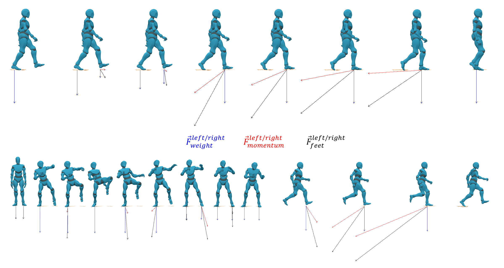
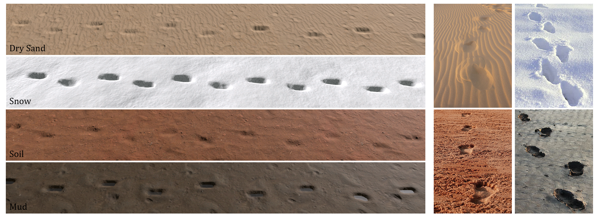

# Real-Time Locomotion on Soft Grounds with Dynamic Footprints

- [Introduction](#Introduction)
- [Real-time Terrain Deformation](#Terrain)
- [Instructions](#Instructions)
- [Results](#Results)
- [Citation](#Citation)
- [License](#License)

## Introduction

This repository provides the codes used to reproduce the results shown in the following paper: **Real-Time Locomotion on Soft Grounds with Dynamic Footprints**. Eduardo Alvarado, Chloé Paliard, Damien Rohmer, Marie-Paule Cani.

Our system takes as input a character model, ie. a mesh geometry, a rigged skeleton with kinematic animations and an IK system applied to the feet bones, on top of a simple proxy-geometry and rigid body used for balance control and collision processing. Then, it builds a real-time locomotion model that combines a global controller to adjust the overall character pose based on the ground slope, enabling tilting and balancing behaviors, with an IK system to adapt the model to non-flat terrains.

In order to reproduce two-ways interactions between the model and the environment, the character deforms the soft ground based on a custom-made light-weight force model for feet-to-ground contact, driven by the kinematics on the input motion and the nature of the terrain. Finally, a versatile model based on Hooke's law is used for ground deformation, parametrized by the Young modulus in compression and by the Poisson ratio in lateral material displacement.

  
&nbsp; &nbsp;
  

  
&nbsp; &nbsp;
  

<em>Figure 1: Examples of footprints caused by different character morphologies in various ground types, such as snow or sand.</em>

## Real-time Terrain Deformation

We propose a model for the forces that the character applies to the ground when its feet are in contact with it, based on its kinematics and the nature of the ground. The resulting interaction forces over time are used to compute a plausible ground deformation.

The static forces that the model exerts on the ground are estimated based on the character's mass *m*, the contact area between the feet and the ground and the balance described by the contribution of each foot to the character's weight. In addition, a dynamic force model during contact takes into consideration the force that each foot generates due to its change of momentum when it lands into the ground with certain velocity. In order to define the time needed for the character to be fully stopped by a given type of terrain, we introduce an external parameter called the *characteristic time τ*. Therefore, a given forward kinematics motion provided as input can be associated to different forces, ie. a large magnitude of momentum force on a hard terrain with small *τ* value, and small force magnitude with long effect on a soft terrain with large *τ*.

  

<em>Figure 2: Forces generated during the kinematic motion. Blue: weight - Red: momentum forces - Black: foot-to-ground forces.</em>

Finally, we use a linear plastic model for terrain compression along with a ray-casting method to map the estimated forces into the respective ground deformation. Parameters such as the Young Modulus of Elasticity *E* or Poisson ratio *ν* can be modified to change the behavior of the terrain under deformation.

*For more information, please refer to the paper.*

## Instructions

The repository contains all the necessary assets to run the project without additional material. The last version has been tested on the **Unity version 2020.3.21f1**. Inside the `Assets`, the following structure is introduced:

    .
    ├── ...
    ├── Assets 
    │   ├── ...		
    │   ├── Materials           # Materials used for models/grounds
    │   ├── Models              # Character models containing animation clips, state-machines or rigs
    │   ├── Scenes              # Scenes ready-to-use
    │   ├── Scripts             # .cs scripts for terrain deformation
    │   ├── Terrain Data        # Data files corresponding to terrain heightmaps
    │   ├── Textures            # Textures used for models/grounds
    │   └── ...                
    ├── Docs
    ├── ...				
    ├── README.md
    └── LICENSE

Go to `Assets > Scenes` and open the `Terrain Deformation` scene. Click in the **play button**, and after that, **select** the Game Object `Terrain` in the hierarchy **to trigger on the deformation system**. In the `Game` window, you will find an environment where you can move your character, along with an interface to modify the terrain deformation parameters.

  

<em>Figure 3: Demo interface for terrain deformation.</em>

In order to start deforming the terrain while you move, make sure that the option `Deformation` in the upper-left corner is active. If you want to activate the lateral dispacement, select the opcion `Bump`. To activate the post-processing step using Gaussian Blur, activate `Post-processing`. The options are:

* **Terrain Options**:
	* ** Young's Modulus *E* **: Defines the elastic constant of the terrain, measured in [Pa]. It has a direct impact on the terrain compressibility. Smaller values lead to more compressible terrains, and therefore deeper deformations.
	* ** Contact Time *τ* **: Defines the characteristic time of the terrain, measure in [s]. It is the time needed for the character to be fully stopped by a given type of terrain, during which the ground exerts a reaction force. Larger values lead to smaller force values during a larger period of time, while smaller values lead to stronger reaction forces during a short period of time.
	* ** Poisson Ratio *ν* **: Defines the amount of volume preserved at the end of the deformation, and is adimensional. An ideal incompressible material has a Poisson ratio of 0.5. This will cause a larger bump while the option is active, as the volume during the deformation is totally preserved. As the value of *ν* gets smaller, the material compresses and the amount of volume displaced on the outline of the footprint will be lower.
	* **Gaussian Iteratons**: Number of iterations for the Gaussian Blur filter. Larger values lead to smoother footprint results.
* **Show**:
	* **Raycast Grid**: Displays raycast method to estimate the contact area between the ground and the feet.
	* **Bump**: Displays contour of the footprint.
	* **Wireframe**: Switches to wireframe mode to show the 3D terrain mesh and the deformations.
	* **Forces**: Displays force model from the kinematic animation in real-time.
* **Forces**: Prints the values for weight, momentum forces and ground reaction forces per foot. Measured in [N].
* **Deformation**: Prints the values for the feet positions, number of ray hits used to calculate the contact area, pressure per foot measured in [N/m²] and compressive displacement per foot measured in [mm].

## Results

  

  

  

## Citation

*In progress*

## License

The code is released under MIT License. See LICENSE for details.