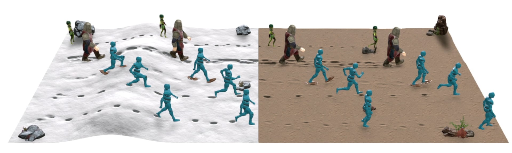

# Real-Time Locomotion on Soft Grounds with Dynamic Footprints

- [Introduction](#Introduction)
- [Citation](#Citation)
- [License](#License)

## Introduction

This repository provides the codes used to reproduce the results shown in the following paper: **Real-Time Locomotion on Soft Grounds with Dynamic Footprints**. Eduardo Alvarado, Chloé Paliard, Damien Rohmer, Marie-Paule Cani.

  
&nbsp; &nbsp; &nbsp; &nbsp;
  

  

  
&nbsp; &nbsp; &nbsp; &nbsp;
  

## Citation

*In progress*

## License

The code is released under MIT License. See LICENSE for details.